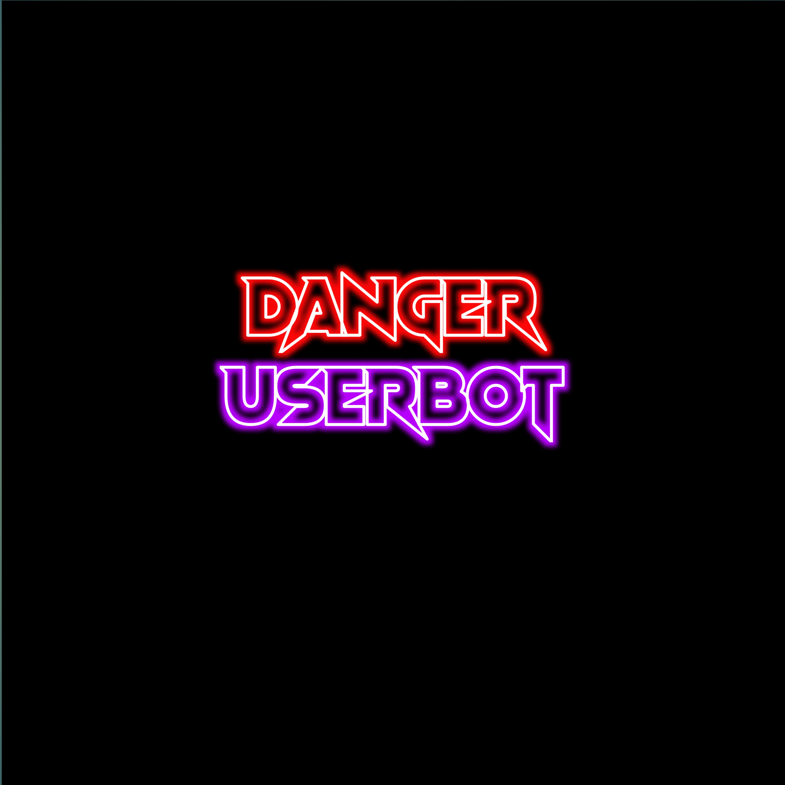

  

<h1 align="center">
  <b>Danger - UserBot</b>
</h1>

<b>A stable pluggable Telegram userbot + Voice & Video Call music bot, based on Telethon.</b>

  
 

   

  
 

----

# Deploy
- [Heroku](#Deploy-to-Heroku)

# Tutorial 
- Full Tutorial - 

- Tutorial to get Redis URL and password - [here.](./resources/extras/redistut.md)
---

## Deploy to Heroku
Get the [Necessary Variables](#Necessary-Variables) and then click the button below!  

---
## Necessary Variables
- `SESSION` - SessionString for your accounts login session. Get it from [here](#Session-String)

One of the following database:
- For **Redis** (tutorial [here](./resources/extras/redistut.md))
  - `REDIS_URI` - Redis endpoint URL, from [redislabs](http://redislabs.com/).
  - `REDIS_PASSWORD` - Redis endpoint Password, from [redislabs](http://redislabs.com/).
- For **MONGODB**
  - `MONGO_URI` - Get it from [mongodb](https://mongodb.com/atlas).
- For **SQLDB**
  - `DATABASE_URL`- Get it from [elephantsql](https://elephantsql.com).

## Session String
* 

---

# License
   
Ultroid is licensed under [GNU Affero General Public License](https://www.gnu.org/licenses/agpl-3.0.en.html) v3 or later.

---

> Made with 💕 by [@TeamDanger](https://t.me/TEAM_DANGER_USERBOT).    
